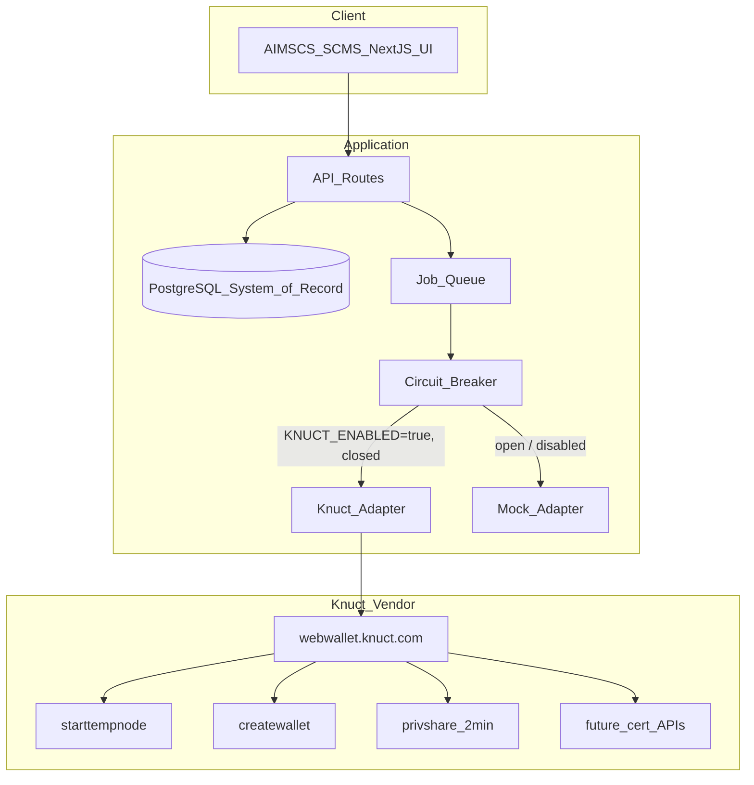
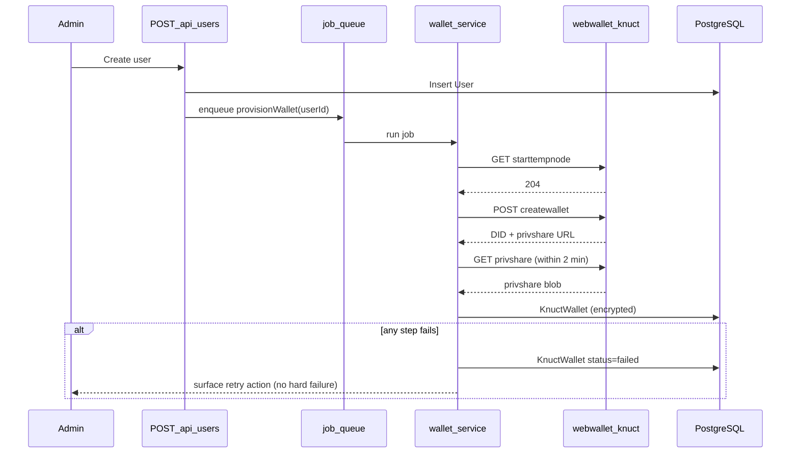
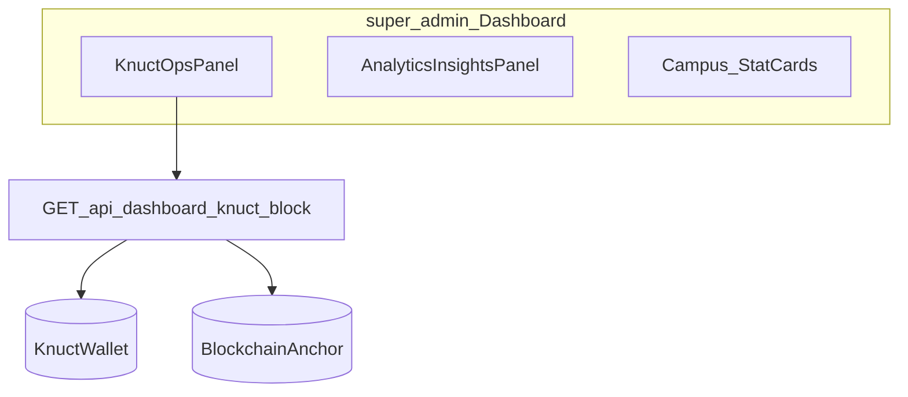

# Knuct Blockchain Integration
## Technical Understanding & Architecture Report (v2 — Enhanced)

**Project:** AIMSCS (Smart Campus Management System)  
**Repository:** `atms`  
**Document type:** Integration assessment (vendor API in development)  
**Version:** 2.0 (Enhanced)  
**Author:** SCMS Architecture Team  
**Approval status:** Draft — for stakeholder review  
**Date:** July 2026  
**Status:** Pre-diligence — no vendor commercial/technical commitment made yet

---

## 1. Executive Summary

This report maps the **Knuct** proprietary blockchain protocol and its documented Wallet/DID creation API to the **AIMSCS** application. SCMS is an Attendance Management System (AMS) plus Learning Management System (LMS) built on Next.js, PostgreSQL (Neon), Prisma, next-auth, and role-based APIs. **There is no blockchain integration in the codebase today.**

**Recommendation:** Treat Knuct as a third-party vendor dependency in active development — not a stable production core. Wrap all Knuct calls behind an internal adapter (mirroring the existing `face-verification.ts` stub pattern). Keep PostgreSQL as the system of record; use Knuct for decentralized identity (DID), optional tamper-evident anchoring, and future verifiable credentials once certificate APIs are documented.

**Rough sequencing:** Phase 0 (vendor diligence) and Phase 1 (wallet/DID PoC) are the only phases that can start today — everything downstream is blocked on Knuct producing certificate/credential APIs. Treat Phase 1 as a bounded, reversible pilot (e.g., one college / one cohort) rather than a campus-wide rollout, until Phase 0 questions (Section 14) are answered in writing by the vendor.

**Commercial framing:** Given the vendor's own documentation describes the wallet service as "in development mode," burden of proof that this is production-viable for a real student population should sit with Knuct — request a written SLA, a staging tenant separate from the public dev sandbox, and a sample of the certificate/mint APIs before Phase 2 scoping begins.

---

## 2. What Knuct Is (Vendor Summary)

Knuct is positioned as a Java-based blockchain alternative to Ethereum/Bitcoin-style chains.

**Claimed architecture layers (top to bottom):**

| Layer | Description |
|-------|-------------|
| Application Layer | DApps and smart contracts |
| Wallet Layer | Mobile, PC, USB, smart card wallets |
| Consensus Layer | Rapid Multi Party Consensus (PBFT variant) |
| Tokens Layer | Identity, Utility, and Asset tokens |
| Network Layer | Knuct Tokenchain (per-token ledgers) |
| Storage Layer | IPFS-based distributed storage |

Marketing claims (1M TPS, post-quantum immunity via NLSS, proof-of-publish consensus) are **not independently verified** in the materials reviewed. Patent references are applications, not confirmed grants. External-facing SCMS materials should avoid unverified security claims.

### 2.1 Standards-conformance flag

Knuct's "DID" is returned as an IPFS-style CID string (e.g. `QmXksoHVjTpfX9a7...`), not a W3C-conformant `did:` URI (no DID method prefix, no resolvable DID Document, no documented `did:knuct:*` method spec). This matters for SCMS because:

- If SCMS ever needs to interoperate with external verifiers (UGC/AICTE systems, other universities, employer verification portals), a non-standard identifier is a real integration cost later.
- Ask the vendor directly whether a W3C DID Document / resolver exists or is planned. If not, budget for an internal mapping layer (`KnuctWallet.did` → an internally-issued `did:web:` or `did:key:` identifier that SCMS controls and that *references* the Knuct CID as an attribute) so SCMS isn't structurally locked into a single vendor's identifier format.

---

## 3. Documented Knuct API (Wallet + DID Only)

**Base host:** `https://webwallet.knuct.com` (development/test mode)

| Step | Endpoint | Purpose | Critical constraint |
|------|----------|---------|---------------------|
| 1 | `GET /sapi/starttempnode` | Spin up temp node/IPFS for client | Must succeed (204) before step 2 |
| 2 | `POST /sapi/createwallet` | Create wallet + DID | Body: passphrase + 4 seed words from fixed 16-word list |
| 3 | `GET /sapi/{privshare}` | Download private key share | Expires in **2 minutes**; single session; fetch immediately |

**Integration requirement:** Persist the downloaded private share blob (encrypted) mapped to the SCMS user record — not the transient `privshare` URL. No certificate mint, verify, or publish endpoints were included in the reviewed documentation.

**No documented auth mechanism.** There is no API key, bearer token, or tenant header in the spec reviewed. Until the vendor clarifies multi-tenant client identification, assume this sandbox is shared/rate-limited and **do not point production traffic at it**.

---

## 4. Current SCMS Baseline

| Module | Key paths | Blockchain today |
|--------|-----------|------------------|
| Auth & RBAC | `src/lib/auth.ts`, `src/lib/store.ts` | None (next-auth credentials + JWT) |
| Attendance | `src/app/api/attendance/*` | None (sessions, geofence, face stub, violations) |
| LMS | `src/app/api/lms/*` | None (courses, assignments, quizzes, gradebook) |
| Reports | `src/app/api/reports/route.ts`, `src/lib/report-export.ts` | None (analytics + CSV) |
| Audit | `src/lib/audit.ts`, AuditLog model | PostgreSQL only |
| Users | `src/app/api/users/route.ts` | None |

---

## 5. Where Knuct Can Be Applied in SCMS

### 5.1 High-value application areas

| SCMS domain | Knuct capability | Readiness | Trigger / hook point |
|-------------|------------------|-----------|----------------------|
| User identity | DID + wallet | **API documented now** | `POST /api/users` (user registration) |
| Attendance certificate | Asset / identity token | API missing | Reports: 75% compliance threshold |
| Grade transcript | Asset token | API missing | LMS gradebook after final grades |
| Exam eligibility | Identity attestation | API missing | Dashboard/reports attendance ≥ 75% |
| Audit integrity | Proof-of-publish / hash anchor | Partial (hash-only feasible) | Session complete, grade publish, violation review |
| Evidence storage | IPFS | Via `starttempnode` | Selfies, profile images (optional CID reference) |

### 5.2 Areas not aligned (defer)

- Replacing PostgreSQL as primary database — SCMS needs relational queries and RBAC
- Replacing next-auth login in production — Knuct challenge-response auth not documented; API unstable
- Knuct Talk P2P chat — out of SCMS scope
- Per-request `starttempnode` at campus scale — concurrency/cost unknown; requires vendor clarification
- Marketing claims (1M TPS, post-quantum) in AIMSCS UI — unverified

---

## 6. Proposed Architecture

The integration follows an **adapter pattern** already used for face verification (`src/lib/face-verification.ts`): core SCMS logic never calls Knuct directly.

### 6.1 Logical architecture



### 6.2 Proposed code structure

```
src/lib/knuct/
├── types.ts                 # Shared interfaces
├── adapter.ts               # KnuctAdapter interface
├── knuct-client.ts          # HTTP client for vendor API
├── mock-adapter.ts          # Dev/CI when KNUCT_ENABLED=false
├── circuit-breaker.ts       # Trip on repeated vendor failures
├── wallet-service.ts        # provisionWallet(userId)
├── anchor-service.ts        # anchorHash(resource, payload)
├── credential-service.ts    # Stub until vendor cert APIs exist
└── __tests__/
    ├── mock-adapter.test.ts
    └── wallet-service.test.ts
```

### 6.3 Adapter interface (concrete, drop into `types.ts` / `adapter.ts`)

```typescript
// src/lib/knuct/types.ts

export interface KnuctWalletResult {
  did: string;              // vendor CID-style identifier
  privShareUrl: string;     // transient, must be fetched within 2 min
}

export interface KnuctPrivShare {
  raw: Buffer;               // exact bytes as returned by vendor — format TBC (see Section 3)
  fetchedAt: Date;
}

export interface KnuctAdapter {
  /** Step 1: warm up a temp node/IPFS instance. Must resolve before createWallet(). */
  startTempNode(): Promise<void>;

  /** Step 2: create wallet + DID. Caller supplies passphrase + 4 seed words. */
  createWallet(passphrase: string, seedWords: [string, string, string, string]): Promise<KnuctWalletResult>;

  /** Step 3: fetch the private share. MUST be called within 2 minutes of createWallet(). */
  fetchPrivateShare(privShareUrl: string): Promise<KnuctPrivShare>;
}

export const KNUCT_SEED_WORDS = [
  "Hill", "Bull", "Bag", "Window", "Parrot", "Cloud", "Design", "Zebra",
  "Book", "Cat", "Mobile", "Dog", "Tree", "Computer", "Bottle", "Water",
] as const;
```

```typescript
// src/lib/knuct/wallet-service.ts

import type { KnuctAdapter } from "./types";
import { randomUUID } from "crypto";
import { encrypt } from "@/lib/crypto"; // Phase 1: add src/lib/crypto.ts (AES-256-GCM) if not present

export async function provisionWallet(
  adapter: KnuctAdapter,
  userId: string,
  db: PrismaClientLike,
): Promise<void> {
  try {
    await adapter.startTempNode();

    const passphrase = randomUUID();
    const seedWords = pickRandomSeedWords(4); // helper, not shown

    const { did, privShareUrl } = await adapter.createWallet(passphrase, seedWords);

    // Fetch immediately — this is the 2-minute-critical step.
    const share = await adapter.fetchPrivateShare(privShareUrl);
    const encrypted = encrypt(share.raw, process.env.KNUCT_PRIVSHARE_ENC_KEY!);

    await db.knuctWallet.create({
      data: { userId, did, privShareEnc: encrypted, status: "active" },
    });
  } catch (err) {
    await db.knuctWallet.upsert({
      where: { userId },
      update: { status: "failed" },
      create: { userId, did: null, privShareEnc: null, status: "failed" },
    });
    // Never throw up into the user-creation request path — wallet provisioning
    // is best-effort and must not block SCMS core functionality.
    console.error("[knuct] wallet provisioning failed", { userId, err });
  }
}
```

### 6.4 Proposed data model extensions (Prisma)

```prisma
model KnuctWallet {
  id            String   @id @default(cuid())
  userId        String   @unique
  user          User     @relation(fields: [userId], references: [id])
  did           String?  // vendor CID-style identifier; null if provisioning failed
  privShareEnc  Bytes?   // AES-256-GCM encrypted private share; never expose to client
  status        String   @default("pending") // pending | active | failed
  createdAt     DateTime @default(now())
  updatedAt     DateTime @updatedAt

  @@index([status])
}

model BlockchainAnchor {
  id           String   @id @default(cuid())
  resourceType String   // "attendance_session" | "grade_publish" | "violation_review"
  resourceId   String
  payloadHash  String   // sha256 of the canonical resource payload
  knuctTxRef   String?  // populated once vendor publish API exists; null = hash-only, pending anchor
  status       String   @default("pending") // pending | anchored | unavailable
  createdAt    DateTime @default(now())

  @@index([resourceType, resourceId])
}

model BlockchainCredential {
  id            String   @id @default(cuid())
  studentId     String
  type          String   // "attendance_compliance" | "grade_transcript"
  knuctTokenRef String?
  verifyUrl     String?
  issuedAt      DateTime @default(now())
  revokedAt     DateTime?

  @@index([studentId, type])
}
```

### 6.5 Environment configuration

| Variable | Purpose | Default |
|----------|---------|---------|
| `KNUCT_ENABLED` | Use real vs mock adapter | `false` |
| `KNUCT_BASE_URL` | Vendor host | `https://webwallet.knuct.com` |
| `KNUCT_PRIVSHARE_ENC_KEY` | Encrypt privshare at rest (32-byte key) | Required in prod |
| `KNUCT_WALLET_ON_USER_CREATE` | Auto-provision on user create | `false` |
| `KNUCT_MAX_RETRIES` | Retry attempts for `startTempNode`/`createWallet` (not privshare fetch — that's time-boxed, not retry-safe) | `2` |
| `KNUCT_CIRCUIT_BREAKER_THRESHOLD` | Consecutive failures before disabling Knuct calls for a cooldown window | `5` |

---

## 7. Integration Flow — Wallet Provisioning

Sequence for new user registration (server-side only):

1. Admin creates user via `POST /api/users`.
2. If `KNUCT_WALLET_ON_USER_CREATE=true`, enqueue a wallet job via an **in-process async worker** for the Phase 1 pilot (do not block the HTTP response on the 2-minute window). A **dedicated job queue** (e.g. BullMQ) is deferred to Phase 4 hardening.
3. Job worker calls `startTempNode()` → waits for success.
4. Job worker calls `createWallet()` with UUID passphrase + 4 seed words.
5. **Immediately** (same job execution, no queue hop in between) fetches the privshare.
6. Encrypts privshare blob; stores in `KnuctWallet` linked to `userId`.
7. Stores DID on `KnuctWallet`; never logs seed words or plaintext privshare (add an explicit lint/log-scrub rule for this).
8. On failure at any step: mark `status=failed`; SCMS user remains fully usable without blockchain features; surface a retry action in the admin UI rather than auto-retrying indefinitely.



---

## 8. Security & Compliance

SCMS handles student PII (attendance, grades, biometric-adjacent face-verification data) subject to India's **Digital Personal Data Protection Act, 2023 (DPDP)**. Blockchain adds specific considerations:

- **Right to erasure vs. immutability.** DPDP grants data-principal erasure rights; a blockchain anchor is, by design, not erasable. Anchor *hashes* of resource payloads, never raw PII, so an erasure request only requires deleting the PostgreSQL row — the anchored hash becomes an orphaned, non-reversible fingerprint with no PII inside it.
- **Private share custody.** The privshare is effectively a private key. Encrypt at rest using AES-256-GCM, store the encryption key in a secrets manager (not `.env` in the repo), and never expose the decrypted share to any client-side code path.
- **Consent.** If wallet creation is mandatory at signup, add a plain-language notice (not just a checkbox) that a DID is being created and what data (none, if hash-only anchoring) is exposed on a public/consortium ledger.
- **Vendor data-processing agreement.** Before any production traffic hits `webwallet.knuct.com`, confirm where that server is hosted and whether a DPA is in place — this is a third-party sub-processor of student data by virtue of holding the private share, even if encrypted client-side.

---

## 9. Testing Strategy

| Layer | Approach |
|-------|----------|
| Unit | Test `wallet-service.ts` and `anchor-service.ts` exclusively against `mock-adapter.ts`; assert failure paths never throw into the caller |
| Contract | A small, separately-run integration test suite (`KNUCT_ENABLED=true`, run manually / nightly, not in CI-on-every-PR) that hits the real sandbox and validates the 3-step flow still matches the documented shapes — vendor is in active dev, so response shape drift is a real risk |
| Load/concurrency | Before Phase 1 pilot, script N sequential `startTempNode` + `createWallet` calls (start with N=10) to observe vendor sandbox behavior under light concurrency — this doubles as informal answer-gathering for the open question on `starttempnode` reuse (Section 14) |
| Rollback drill | Verify that flipping `KNUCT_ENABLED=false` mid-pilot leaves existing SCMS functionality fully intact and only disables new wallet provisioning |

---

## 10. Observability

- Emit structured logs (no secrets) for each of the 3 API steps with timing, so privshare-expiry near-misses are visible before they become failures.
- Track a `knuct_wallet_status` metric (pending/active/failed counts) on the **super_admin dashboard** `KnuctOpsPanel` (Section 12.7) and in the reports module — reuse existing analytics rather than building new tooling.
- Alert if the circuit breaker trips (Section 6.5) — signals the vendor sandbox is degraded and campus-wide rollout should not proceed.

---

## 11. Phased Roadmap

| Phase | Scope | Dependencies | Rough effort (dev-days, single developer) |
|-------|-------|--------------|---------------------------------------------|
| **0 — Vendor diligence** | Confirm privshare format, cert APIs, rate limits, `starttempnode` scaling, DPA/hosting location | Knuct vendor | 2–3 (mostly waiting on vendor answers) |
| **1 — Wallet/DID PoC** | Adapter + mock, `KnuctWallet` schema, user-create hook, in-process wallet worker, settings UI, unit tests, **super_admin KnuctOpsPanel (status)**, basic Knuct health ping | Documented API only | 5–8 |
| **2 — Verifiable credentials** | Attendance cert, grade transcript, public `/verify` page, **super_admin credential metrics** | Knuct mint/verify APIs (not yet available) | Not estimable until vendor API exists |
| **3 — Audit anchoring** | Hash anchors on session complete, grade publish, violation review, **super_admin anchor feed** | Adapter + optional cert publish | 4–6 |
| **4 — Production hardening** | Dedicated job queue, encryption rotation, full circuit-breaker health checks, DPA sign-off | Operational readiness | 3–5 |

These are rough sizing estimates for planning purposes only, not commitments — Phase 0 findings could change Phase 1 scope materially (e.g., if the privshare format requires unexpected handling).

---

## 12. SCMS Module Integration Map

### 12.0 Summary table (primary UI sections)

| SCMS section | UI component | Knuct integration | Phase |
|--------------|--------------|-------------------|-------|
| Users & RBAC | `users-section.tsx` | Wallet on user create; DID + status badge in profile | 1 |
| Settings | `settings-section.tsx` | Show DID + wallet status; manual retry action | 1 |
| **Dashboard (super_admin)** | `dashboard-section.tsx` | **Knuct Operations Center** — adapter health, wallet stats, anchor/credential feed | 1–3 |
| Attendance | `attendance-section.tsx` | Anchor session summary on complete | 3 |
| Violations | `violations-section.tsx` | Anchor review decision | 3 |
| LMS Gradebook | `lms-section.tsx` | Issue on-chain grade credential | 2 |
| Reports | `reports-section.tsx` | Issue attendance compliance credential; wallet status metric panel | 2 |
| Geofences | `geofences-section.tsx` | Anchor geofence policy changes | 3 |
| Calendar | `calendar-section.tsx` | Anchor published academic calendar events | 3 |
| Masters | `masters-section.tsx` | Anchor subject/program publish; curriculum credential | 2–3 |
| Audit | `api/audit/route.ts` | Show anchor status column | 3 |

Knuct can be applied across **all 10 UI sections**, **40 API routes**, **cross-cutting services**, and **22 Prisma models**. Full inventory below.

**Integration types:**

| Type | Meaning |
|------|---------|
| **Wallet/DID** | Provision Knuct wallet + decentralized ID on user lifecycle |
| **Credential** | Issue verifiable asset/identity token (needs Knuct cert APIs) |
| **Anchor** | Hash critical event to chain for tamper evidence |
| **IPFS** | Store evidence blob off-chain; reference CID in DB |
| **Verify** | Public or in-app verification of on-chain credential |

### 12.1 UI sections (10 modules)

| # | Module | UI file | Roles | Knuct use case | Type | Phase | Hook / API |
|---|--------|---------|-------|----------------|------|-------|------------|
| 1 | **Dashboard** | `dashboard-section.tsx` | All (see **§12.7** for `super_admin`) | Student risk badges; **super_admin Knuct Operations Center** | Anchor, Credential, Verify | 1–3 | `GET /api/dashboard` |
| 2 | **Attendance** | `attendance-section.tsx` | Most roles | Anchor completed session summary; credential for session completion | Anchor, Credential | 2–3 | `POST /api/attendance/sessions`, `POST /api/attendance/mark` |
| 3 | **LMS** | `lms-section.tsx` | Admin, HOD, faculty, student, parent | Grade transcript credential; anchor published grades | Credential, Anchor | 2–3 | `POST /api/lms/gradebook`, submissions, quizzes |
| 4 | **Users & RBAC** | `users-section.tsx` | Admin, HOD | Auto-provision wallet on user create; DID in profile | Wallet/DID | 1 | `POST /api/users` |
| 5 | **Violations** | `violations-section.tsx` | Admin, HOD, faculty, security | Anchor violation review decision | Anchor | 3 | `PATCH /api/attendance/violations` |
| 6 | **Reports** | `reports-section.tsx` | Staff, student, parent | Attendance compliance credential (≥75%); verify URL in CSV | Credential | 2 | `GET /api/reports` |
| 7 | **Geofences** | `geofences-section.tsx` | Admin, HOD, faculty, lab, security | Anchor geofence policy changes | Anchor | 3 | `POST /api/geofences` |
| 8 | **Calendar** | `calendar-section.tsx` | Most roles | Anchor published academic calendar events | Anchor | 3 | `POST /api/calendar` |
| 9 | **Masters** | `masters-section.tsx` | Admin, HOD | Anchor subject/program publish; curriculum credential | Anchor, Credential | 2–3 | `POST /api/masters/subjects/publish` |
| 10 | **Settings** | `settings-section.tsx` | Admin, super_admin | Wallet/DID status; manual retry; profile image CID | Wallet/DID, IPFS | 1 | Settings, profile-image API |

### 12.2 API route modules (by domain)

#### Authentication & identity

| Route | Knuct use case | Type | Phase |
|-------|----------------|------|-------|
| `POST /api/auth/[...nextauth]` | Optional future Knuct login (not documented) | Wallet/DID | Defer |
| `POST /api/users` | Provision wallet on create | Wallet/DID | 1 |
| `PATCH /api/users/[id]` | Re-provision or link DID | Wallet/DID | 1 |
| `POST /api/users/profile-image` | IPFS CID for image | IPFS | 2 |

#### Attendance, LMS, Masters, Operations

See Sections 12.0–12.1 for hook points. Key routes: `attendance/sessions`, `attendance/mark`, `attendance/violations`, `lms/gradebook`, `lms/enrollments`, `masters/subjects/publish`, `geofences`, `calendar`, `audit`, `health`, `demo/bootstrap`.

| Route | Knuct use case | Type | Phase |
|-------|----------------|------|-------|
| `GET /api/dashboard` | **super_admin:** Knuct ops metrics; all roles: badges where applicable | Verify, Wallet/DID | 1–3 |
| `GET /api/health` | Basic Knuct adapter ping (Phase 1, super_admin panel); full circuit-breaker health (Phase 4) | — | 1 / 4 |

### 12.3 Cross-cutting services (lib layer)

| Service | File | Knuct use case | Phase |
|---------|------|----------------|-------|
| Audit logging | `src/lib/audit.ts` | Dual-write + optional anchor hash | 3 |
| Face verification | `src/lib/face-verification.ts` | IPFS evidence + anchor result | 2–3 |
| Reports analytics | `src/lib/reports-analytics.ts` | Credential eligibility (75% rule) | 2 |
| Report export | `src/lib/report-export.ts` | Verify URL in CSV | 2 |
| Auth | `src/lib/auth.ts` | Link session to `KnuctWallet` | 1 |
| Circuit breaker | `src/lib/knuct/circuit-breaker.ts` | Vendor failure isolation | 4 |

### 12.4 Data models (Prisma) — anchor/credential targets

| Model | Knuct integration | Priority |
|-------|-------------------|----------|
| `User` | `KnuctWallet` relation | **High** |
| `AttendanceSession`, `AttendanceRecord`, `AttendanceViolation` | Session/violation anchors | **High** |
| `GradeBook` | Grade credential + anchor | **High** |
| `AuditLog` | Link to `BlockchainAnchor` | **High** |
| `Submission`, `QuizAttempt`, `CourseEnrollment`, `Subject`, `Geofence` | Medium priority anchors/credentials |
| `FaceEmbedding`, `BiometricRecord` | IPFS CID only — never raw biometrics on chain | Medium |

**New models:** `KnuctWallet`, `BlockchainAnchor`, `BlockchainCredential` (Section 6.4)

### 12.5 Modules where Knuct is **not recommended**

PostgreSQL as primary DB; next-auth replacement; Knuct Talk chat; raw biometrics on chain; production traffic to undocumented sandbox without vendor auth.

### 12.6 Summary by phase

| Phase | Modules covered |
|-------|-----------------|
| **1 — Wallet/DID** | Users, Settings, Demo, **super_admin Dashboard (Knuct status panel)** |
| **2 — Credentials** | Reports, LMS gradebook, Enrollments, Face verify, **super_admin credential metrics** |
| **3 — Anchoring** | Attendance, Violations, LMS, Geofences, Calendar, Masters, Audit, **super_admin anchor feed** |
| **4 — Hardening** | Job queue, circuit breaker, encryption rotation, DPA sign-off |

### 12.7 Super Admin Dashboard — Explicit Implementation Scope

The **super_admin** role uses the full campus view (`AdminDashboard` in `dashboard-section.tsx`) with campus-wide analytics (`analyticsScope === 'campus'`). This is a **first-class implementation target**.

**Why super_admin only:** Full system control, settings access, vendor integration health. `admin` keeps existing dashboard without full ops center.

#### Knuct additions — `KnuctOpsPanel` (super_admin only)

| Widget | Data shown | Phase | Backend source |
|--------|------------|-------|----------------|
| **Adapter status** | `KNUCT_ENABLED`, mock vs live, circuit breaker state | 1 | `GET /api/health` + env |
| **Wallet provisioning** | Total / active / failed / pending | 1 | `KnuctWallet` aggregate |
| **Campus DID coverage** | % users with DID | 1 | `User` + `KnuctWallet` |
| **Credentials issued** | Today / week / failed; by type | 2 | `BlockchainCredential` |
| **Anchors today** | Count by module | 3 | `BlockchainAnchor` groupBy |
| **Recent chain activity** | Last 10 anchors/credentials with tx ref | 3 | Anchors + credentials |
| **Quick actions** | Settings, Users (retry failed), Audit | 1 | UI navigation |

#### API extension — `GET /api/dashboard` (super_admin only)

```typescript
knuct: {
  enabled: boolean;
  adapterMode: 'mock' | 'live';
  health: 'ok' | 'degraded' | 'down';
  circuitBreakerOpen: boolean;
  wallets: { total: number; active: number; failed: number; pending: number };
  didCoveragePct: number;
  credentials: { today: number; week: number; failed: number; byType: Record<string, number> };
  anchors: { today: number; byModule: Record<string, number> };
  recentActivity: Array<{ type: 'anchor' | 'credential'; module: string; ref: string; at: string }>;
}
```

#### Files to implement

| File | Change |
|------|--------|
| `src/app/api/dashboard/route.ts` | Role-gated `knuct` stats for `super_admin` |
| `src/components/sections/dashboard-section.tsx` | `KnuctOpsPanel` in `AdminDashboard` for `super_admin` only |
| `src/lib/knuct/types.ts` | `KnuctDashboardStats` type |



---

## 13. Risks and Mitigations

| Risk | Impact | Mitigation |
|------|--------|------------|
| Vendor API unstable / test mode | Wallet provisioning fails | Mock adapter; feature flag; non-blocking failures; contract test suite (Section 9) |
| 2-minute privshare expiry | Lost private share | Synchronous fetch within same job execution; no queue hop between steps 2 and 3 |
| `starttempnode` per client | Scale/cost at 1000+ students | Clarify with Knuct (Section 14); load-test at small N first (Section 9) |
| Missing certificate APIs | Cannot issue credentials | Phase 2 blocked; hash anchoring in Phase 3 as interim |
| Privshare storage security | Key compromise | Encrypt at rest; secrets-manager key custody; never expose to browser |
| Non-standard DID format | Future interoperability cost | Internal mapping layer if external verification needed (Section 2.1) |
| DPDP / student-data compliance | Regulatory exposure | Hash-only anchoring for PII; DPA before production (Section 8) |
| Unverified security claims | Compliance/reputation | Do not use in AIMSCS external materials without independent audit |
| No documented vendor auth | Unclear tenant isolation | Do not point production at current sandbox; require vendor auth before pilot expands |

---

## 14. Open Questions for Knuct Vendor

1. What is the exact format of the downloaded privshare (binary, image, JSON)?
2. What are the certificate/asset token mint, publish, and public verify API endpoints?
3. Is there an API key or tenant ID for multi-client production use, and how is tenant isolation enforced?
4. What are error codes and safe retry semantics, given the "do not retry" warning in the current doc?
5. Can one `starttempnode` instance serve multiple wallet creations, or is it strictly 1:1 per user?
6. What is the cost/concurrency model for campus-scale (1,000+ student) onboarding?
7. Is there a W3C-conformant DID Document/resolver, or is the CID the entire identity artifact? (Section 2.1)
8. Where is `webwallet.knuct.com` hosted, and is a data-processing agreement available for student-data handling under India's DPDP Act? (Section 8)
9. Is there a dedicated staging/sandbox tenant separate from the shared public dev environment referenced in the current docs?
10. After privshare download, is the wallet passphrase still required for future operations, and should SCMS persist it encrypted alongside the privshare?

---

## 15. Conclusion

Knuct is most immediately applicable to AIMSCS as a **decentralized identity layer** (wallet + DID per user) using the documented API. Higher-value campus use cases — verifiable attendance certificates, grade transcripts, and tamper-evident audit trails — align strongly with SCMS data models but require additional Knuct APIs not yet available.

The recommended approach is a **phased, adapter-based integration** that preserves PostgreSQL as the authoritative store, keeps blockchain features optional and feature-flagged until vendor APIs mature, and treats Phase 1 as a small, reversible pilot rather than a campus-wide commitment — with the vendor bearing the burden of answering Section 14 in writing before Phase 0 is considered closed.

---

*End of Report*
